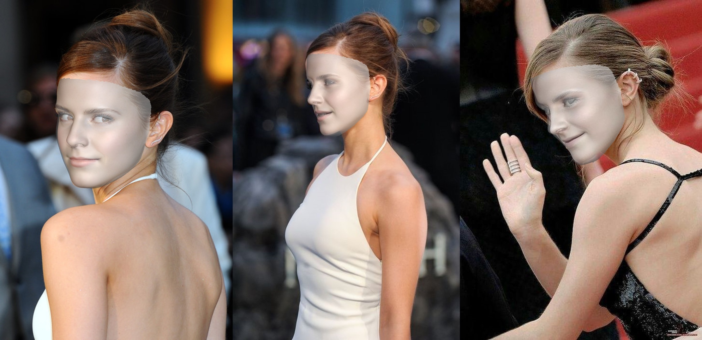
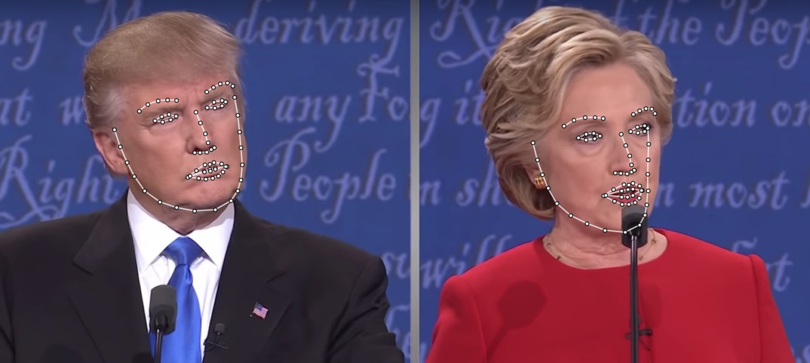
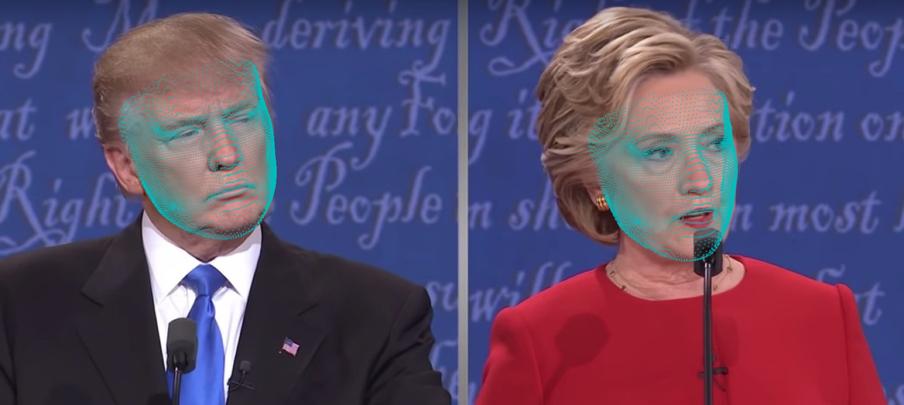
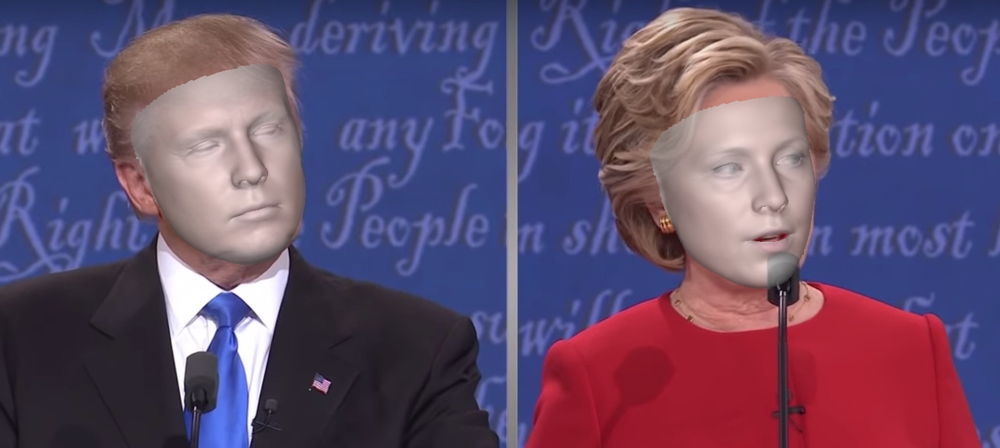
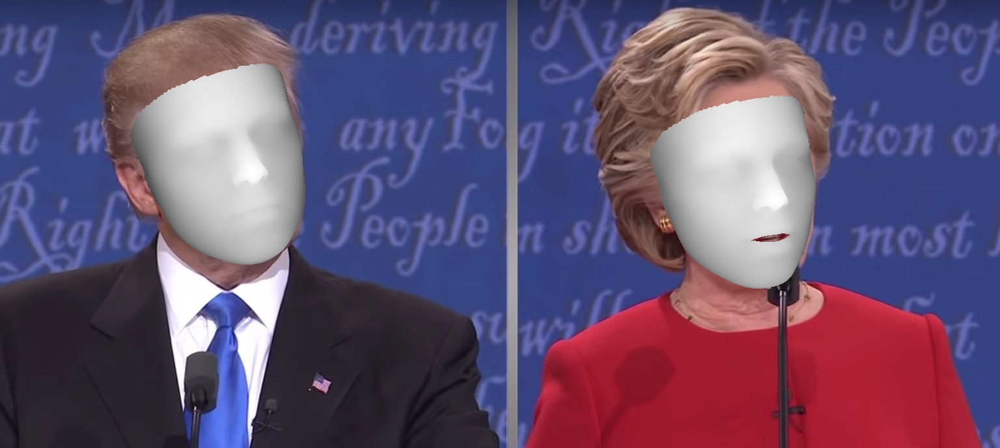
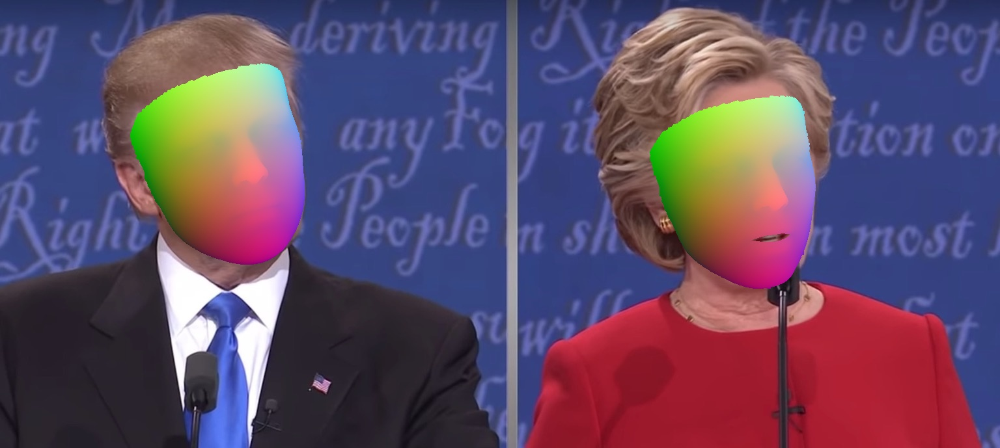
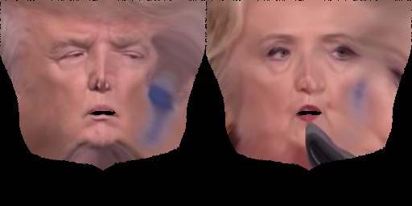
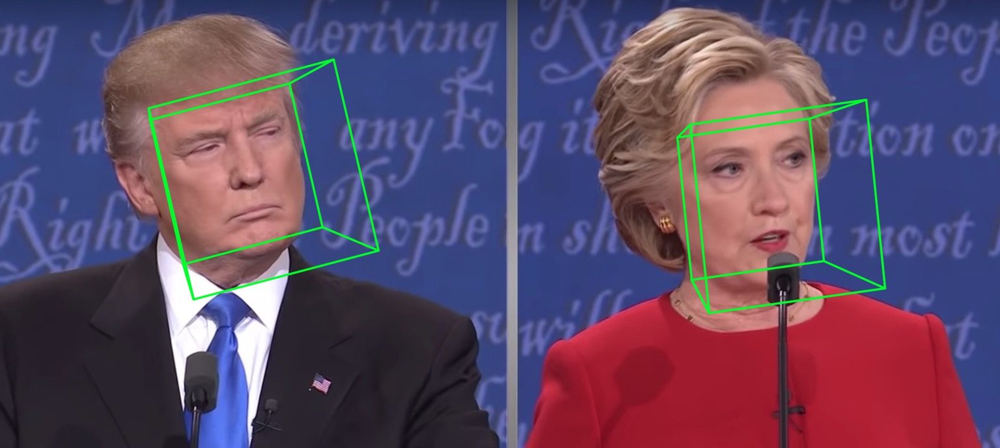
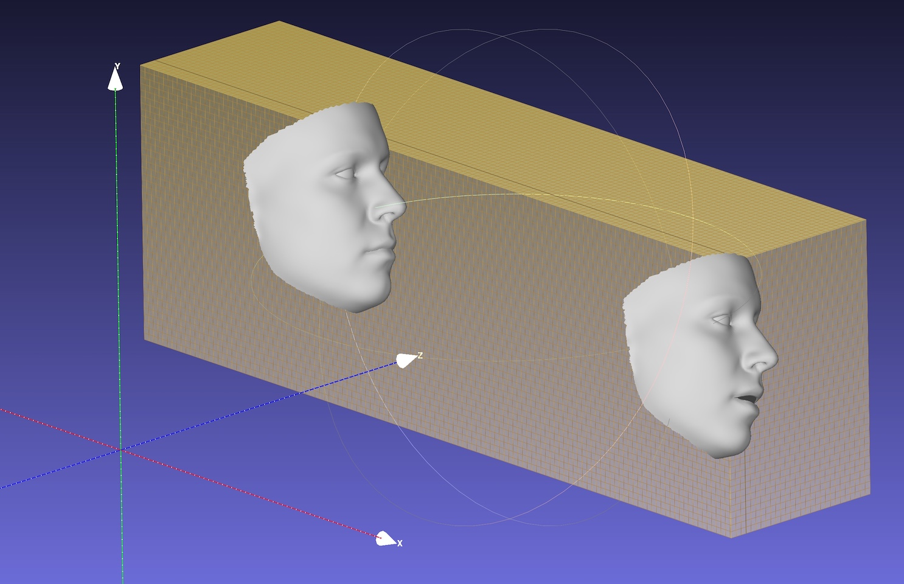
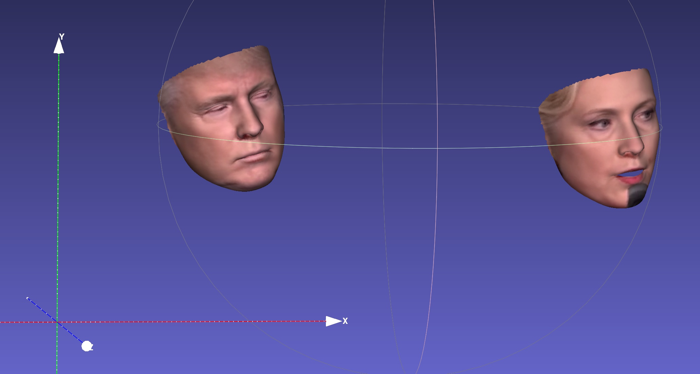

# Towards Fast, Accurate and Stable 3D Dense Face Alignment

[](LICENSE)

[](https://www.codefactor.io/repository/github/cleardusk/3ddfa_v2)
[](https://colab.research.google.com/drive/1OKciI0ETCpWdRjP-VOGpBulDJojYfgWv)

By [Jianzhu Guo](https://guojianzhu.com), [Xiangyu Zhu](http://www.cbsr.ia.ac.cn/users/xiangyuzhu/), [Yang Yang](http://www.cbsr.ia.ac.cn/users/yyang/main.htm), Fan Yang, [Zhen Lei](http://www.cbsr.ia.ac.cn/users/zlei/) and [Stan Z. Li](https://scholar.google.com/citations?user=Y-nyLGIAAAAJ). The code repo is maintained by **[Jianzhu Guo](https://guojianzhu.com)**.

<p align="center">
  
</p>

**\[Updates\]**
 - `2020.9.20`: Add features including pose estimation and serializations to .ply and .obj, see `pose`, `ply`, `obj` options in [demo.py](./demo.py).
 - `2020.9.19`: Add PNCC (Projected Normalized Coordinate Code), uv texture mapping features, see `pncc`, `uv_tex` options in [demo.py](./demo.py).


## Introduction

This work extends [3DDFA](https://github.com/cleardusk/3DDFA), named **3DDFA_V2**, titled [Towards Fast, Accurate and Stable 3D Dense Face Alignment](https://guojianzhu.com/assets/pdfs/3162.pdf), accepted by [ECCV 2020](https://eccv2020.eu/). The supplementary material is [here](https://guojianzhu.com/assets/pdfs/3162-supp.pdf). The [gif](./docs/images/out.gif) above shows a demo of the tracking result.
This repo is the official implementation of 3DDFA_V2.

Compared to [3DDFA](https://github.com/cleardusk/3DDFA), 3DDFA_V2 achieves better performance and stability. Besides, 3DDFA_V2 incorporates the fast face detector [FaceBoxes](https://github.com/zisianw/FaceBoxes.PyTorch) instead of Dlib. A simple 3D render written by c++ and cython is also included. If you are interested in this repo, just try it on this **[google colab](https://colab.research.google.com/drive/1OKciI0ETCpWdRjP-VOGpBulDJojYfgWv)**! Welcome for valuable issues and PRs 😄

<!-- Currently, the pre-trained model, inference code and some utilities are released.  -->

## Getting started

### Requirements
See [requirements.txt](./requirements.txt), tested on macOS and Linux platforms. Note that this repo uses Python3. The major dependencies are PyTorch, numpy and opencv-python, etc.

### Usage

1. Clone this repo
   
```shell script
git clone https://github.com/cleardusk/3DDFA_V2.git
cd 3DDFA_V2
```

2. Build the cython version of NMS, and Sim3DR
<!-- ```shell script
cd FaceBoxes
sh ./build_cpu_nms.sh
cd ..

cd Sim3DR
sh ./build_sim3dr.sh
cd ..
```

or simply build them by -->
```shell script
sh ./build.sh
```

3. Run demos

```shell script
# 1. running on still image, the options include: 2d_sparse, 2d_dense, 3d, depth, pncc, pose, uv_tex, ply, obj
python3 demo.py -f examples/inputs/emma.jpg  # -o [2d_sparse, 2d_dense, 3d, depth, pncc, pose, uv_tex, ply, obj]

# 2. running on videos
python3 demo_video.py -f examples/inputs/videos/214.avi

# 3. running on videos smoothly by looking ahead by `n_next` frames
python3 demo_video_smooth.py -f examples/inputs/videos/214.avi

# 4. running on webcam
python3 demo_webcam_smooth.py
```

The implementation of tracking is simply by alignment. If the head pose > 90° or the motion is too fast, the alignment may fail. A threshold is used to trickly check the tracking state, but it is unstable.

You can refer to [demo.ipynb](./demo.ipynb) or [google colab](https://colab.research.google.com/drive/1OKciI0ETCpWdRjP-VOGpBulDJojYfgWv) for the step-by-step tutorial of running on the still image.

For example, running `python3 demo.py -f examples/inputs/emma.jpg -o 3d` will give the result below:

<p align="center">
  
</p>

Running on webcam will give:

<p align="center">
  
</p>

Obviously, the eyes parts are not good.

### Features (up to now)


<table>
  <tr>
    <th>2D sparse</th>
    <th>2D dense</th>
    <th>3D</th>
  </tr>

  <tr>
    <td></td>
    <td></td>
    <td></td>
  </tr>

  <tr>
    <th>Depth</th>
    <th>PNCC</th>
    <th>UV texture</th>
  </tr>

  <tr>
    <td></td>
    <td></td>
    <td></td>
  </tr>

  <tr>
    <th>Pose</th>
    <th>Serialization to .ply</th>
    <th>Serialization to .obj</th>
  </tr>

  <tr>
    <td></td>
    <td></td>
    <td></td>
  </tr>

</table>

### Configs

The default backbone is MobileNet_V1 with input size 120x120 and the default pre-trained weight is `weights/mb1_120x120.pth`, shown in [configs/mb1_120x120.yml](configs/mb1_120x120.yml). This repo provides another config in [configs/mb05_120x120.yml](configs/mb05_120x120.yml), with the widen factor 0.5, being smaller and faster. You can specify the config by `-c` or `--config` option. The released models are shown in the below table. Note that the inference time is evaluated using TensorFlow. The benchmark is unstable across different runtimes or frameworks. However, I believe the [onnxruntime](https://github.com/microsoft/onnxruntime) should perform best and maybe faster than the reported values.


| Model | Input | #Params | #Macs | Inference |
| :-: | :-: | :-: | :-: | :-: |
| MobileNet  | 120x120 | 3.27M | 183.5M | ~6.2ms |
| MobileNet x0.5 | 120x120 | 0.85M | 49.5M | ~2.9ms |


## FQA

1. What is the training data?

    We use [300W-LP](https://drive.google.com/file/d/0B7OEHD3T4eCkVGs0TkhUWFN6N1k/view?usp=sharing) for training. You can refer to our [paper](https://guojianzhu.com/assets/pdfs/3162.pdf) for more details about the training. Since few images are closed-eyes in the training data 300W-LP, the landmarks of eyes are not accurate when closing.

## Acknowledgement

* The FaceBoxes module is modified from [FaceBoxes.PyTorch](https://github.com/zisianw/FaceBoxes.PyTorch).
* A list of previous works on 3D dense face alignment or reconstruction: [3DDFA](https://github.com/cleardusk/3DDFA), [face3d](https://github.com/YadiraF/face3d), [PRNet](https://github.com/YadiraF/PRNet).

## Citation

If your work or research benefits from this repo, please cite two bibs below : )

    @inproceedings{guo2020towards,
        title =        {Towards Fast, Accurate and Stable 3D Dense Face Alignment},
        author =       {Guo, Jianzhu and Zhu, Xiangyu and Yang, Yang and Yang, Fan and Lei, Zhen and Li, Stan Z},
        booktitle =    {Proceedings of the European Conference on Computer Vision (ECCV)},
        year =         {2020}
    }

    @misc{3ddfa_cleardusk,
        author =       {Guo, Jianzhu and Zhu, Xiangyu and Lei, Zhen},
        title =        {3DDFA},
        howpublished = {\url{https://github.com/cleardusk/3DDFA}},
        year =         {2018}
    }

## Contact
**Jianzhu Guo (郭建珠)** [[Homepage](http://guojianzhu.com), [Google Scholar](https://scholar.google.com/citations?user=W8_JzNcAAAAJ&hl=en&oi=ao)]:  **jianzhu.guo@nlpr.ia.ac.cn** or **guojianzhu1994@foxmail.com**.
